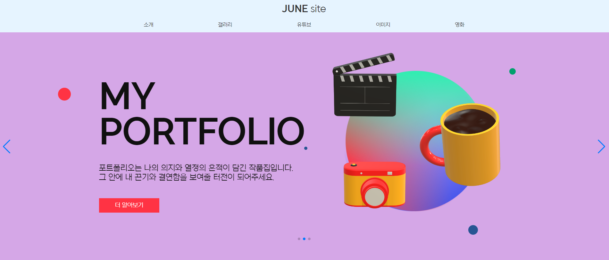

# REACT SITE

REACT 으로 작성한 홈페이지 입니다.

******

사용 스택
---

react.js: 선언적 UI 프로그래밍과 컴포넌트 기반 아키텍처를 통해 유연하고 재사용 가능한 UI를 만들어주는 강력한 프론트엔드 라이브러리입니다   
SCSS: style 태그 내에서 사용된 lang="scss" 속성은 해당 스타일이 SCSS(Sass)로 작성되었다는 것을 나타냅니다. SCSS는 CSS의 확장 문법으로, 보다 간결하고 효율적인 스타일 코드를 작성할 수 있도록 해줍니다.  
fetch : JavaScript의 fetch 함수를 사용하여 외부 API에 HTTP 요청을 보냅니다. API를 사용하여 자료들 검색하고 가져옵니다.  
await과 async : 비동기 함수를 구현합니다. 이를 통해 비동기적으로 API 호출을 처리하고, 결과가 도착하면 해당 데이터를 업데이트합니다.  
swiper : Swiper.js를 함께 사용하는 가장 큰 장점은 모바일 친화적인 슬라이더와 캐러셀 컴포넌트를 쉽게 구현할 수 있다는 것입니다.

*******

프로젝트 실행
---
npm run start

# 프로젝트 목적

---

+ 리엑트 이해
+ 리엑트 컴포넌트 구조 이해
